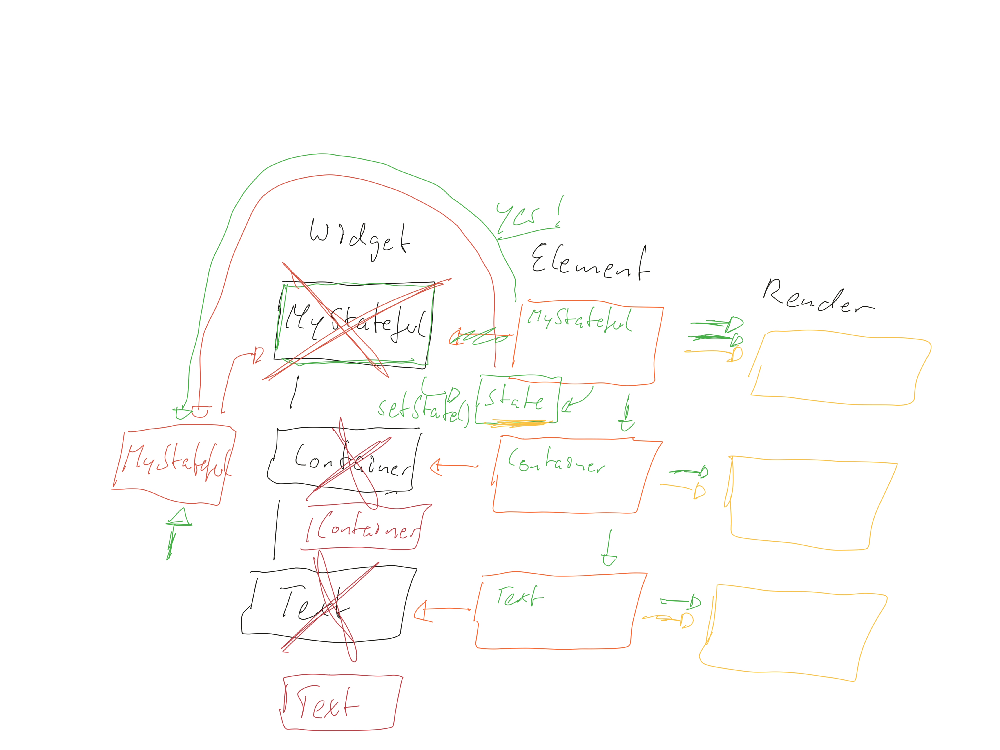

# finance_management_app

A new Flutter project.

## Getting Started

This project is a starting point for a Flutter application.

A few resources to get you started if this is your first Flutter project:

- [Lab: Write your first Flutter app](https://docs.flutter.dev/get-started/codelab)
- [Cookbook: Useful Flutter samples](https://docs.flutter.dev/cookbook)

For help getting started with Flutter development, view the
[online documentation](https://docs.flutter.dev/), which offers tutorials,
samples, guidance on mobile development, and a full API reference.

App Setup Android
-

- MaterialApp
- Scaffold

Layout
-

- Container
- Row
- Column

Row/Column Children
-

- Flexible
- Expanded

Content Containers
-

- Stack
- Card

Repeat Elements
-

- ListView
- GridView
- ListTile

Content Types
-

- Text
- Image
- Icon

UserInput
-

- TextField
- ElevateButton
- GestureDetector
- InkWell

Containers vs Column / Row
=

|Container|Column/Row|
|-------------------------|--------------------------|
|Takes exactly one child widget|Takes multiple (unlimited) child widgets|
|Rich alignment & styling options | Alignment but no styling options|
|Flexible width (e.g child width, available width, ...)| Always takes full available height (column) / width (row)
|Perfect for custom styling & alignment | Must-use if widgets sit next to/ above each other

Date Formatting
-

- Required package: [intl](https://pub.dev/packages/intl)

DateFormat Patterns
-

- The [intl](https://pub.dev/packages/intl) package supports a broad range of date formatting patterns. Here's a list (taken from the official docs):

|DAY           |               d|
|--------------------|------------|
 |ABBR_WEEKDAY              |   E|
 |WEEKDAY            |          EEEE|
 |ABBR_STANDALONE_MONTH  |      LLL|
 |STANDALONE_MONTH     |        LLLL|
 |NUM_MONTH          |          M||
 |NUM_MONTH_DAY    |            Md|
 |NUM_MONTH_WEEKDAY_DAY  |      MEd|
 |ABBR_MONTH          |         MMM|
 |ABBR_MONTH_DAY     |          MMMd|
 |ABBR_MONTH_WEEKDAY_DAY   |    MMMEd|
 |MONTH                 |       MMMM|
 |MONTH_DAY               |     MMMMd|
 |MONTH_WEEKDAY_DAY        |    MMMMEEEEd|
 |ABBR_QUARTER      |           QQQ|
 |QUARTER            |          QQQQ|
 |YEAR                |         y|
 |YEAR_NUM_MONTH       |        yM|
 |YEAR_NUM_MONTH_DAY    |       yMd|
 |YEAR_NUM_MONTH_WEEKDAY_DAY|   yMEd|
 |YEAR_ABBR_MONTH       |       yMMM|
 |YEAR_ABBR_MONTH_DAY    |      yMMMd|
 |YEAR_ABBR_MONTH_WEEKDAY_DAY|  yMMMEd|
 |YEAR_MONTH        |           yMMMM|
 |YEAR_MONTH_DAY     |          yMMMMd|
 |YEAR_MONTH_WEEKDAY_DAY|       yMMMMEEEEd|
 |YEAR_ABBR_QUARTER      |      yQQQ|
 |YEAR_QUARTER            |     yQQQQ|
 |HOUR24                   |    H|
 |HOUR24_MINUTE             |   Hm|
 |HOUR24_MINUTE_SECOND|         Hms|
 |HOUR                 |        j|
 |HOUR_MINUTE           |       jm|
 |HOUR_MINUTE_SECOND     |      jms|
 |HOUR_MINUTE_GENERIC_TZ  |     jmv|
 |HOUR_MINUTE_TZ           |    jmz|
 |HOUR_GENERIC_TZ           |   jv|
 |HOUR_TZ                    |  jz|
 |MINUTE        |               m|
 |MINUTE_SECOND  |              ms|
 |SECOND          |             s|


Examples Using the US Locale:

 |Pattern                |     |      Result|
 |----------------     |  ---- |          -------|
 |new DateFormat.yMd()          |   -> |7/10/1996|
| new DateFormat("yMd")          |  -> |7/10/1996|
| new DateFormat.yMMMMd("en_US") |  -> |July 10, 1996|
| new DateFormat.jm()            |  -> |5:08 PM|
| new DateFormat.yMd().add_jm()  |  -> |7/10/1996 5:08 PM|
| new DateFormat.Hm()            |  ->| 17:08 // force 24 hour time|


ListView
-

    - `ListView(children: [])`
    - `ListView.builder()` - only load what's visible

Flutter Basics
-

- Compose UI from built-in and custom Widgets.
- Custom Widgets are also composed from built-in and other custom Widgets.
- Style and configure via arguments.
- Use the docs and IDE support.

Styling and Configuring Widgets
-

- Styling and layout options are very different: `EdgeInsets.all()`, `BoxDecoration()`, enums, ... => Docs + IDE support help you.
- Often, there's more than one Widget or option to get the job done.

Theming
-

- Define a global theme for colors and text to then tap into it from anywhere in the app via Theme.of(context)
- Built-in Widgets use Theme settings automatically.

Business Logic
-

- Lift state up and use stateful widgets only when needed.
- Pass functions references and data around.
- Adjust the UI to your logic.
    
Respinsive and Adaptive User Interfaces
-

`textScaleFactor`
-

```dart
final curScaleFactor = MediaQuery.of(context).textScaleFactor;
```

- `textScaleFactor` tells you by how much text output in the app should be scaled. Users can change this in their mobile phone / device settings.
- Depending on your app, you might want to consider using this piece of information when setting font sizes.

- Consider this example:

 - Text('Always the same size!', style: TextStyle(fontSize: 20));
 - This text ALWAYS has a size of 20 device pixels, no matter what the user changed in his / her device settings.

  ```dart
  Text('This changes!', style: TextStyle(fontSize: 20 * curScaleFactor));
  ```

 - This text on the other hand also has a size of 20 if the user didn't change anything in the settings (because textScaleFactor by default is 1). But if changes were made, the font size of this text respects the user settings.

Widget Tree and Element Tree
-

|Widget Tree |Element Tree     |Render Tree(What you see on the screen)|
|------------|-----------------|----------------------------------------|
|Configuration (rebuilds frequently)|Links widgets with rendered object(rarely rebuilds)| Rendered objects on the screen (rarely rebuilds)|
|Container <- Ref| Container Element ->| Render Box|
| `↳` | _ | _ |
|Column|Column Element|
|MyStateless|MyStateless Element|
|MyStateful|MyStateful Element|

How Flutter Rebuilds & Repaints the Screen
-

- `build()` runs very often and re-builds the widget tree (or part of it).
- Methods of reducing the amount of widgets (including built-in widgets) affected by build()
    - Splitting the app into multiple (small) custom widgets
    - Using const constructors and widgets.



Refactoring
-

|Readability/Understandability| Performance |
|-----------------------------|-------------|
|You should understand your code and be able to maintain/change it| Certain practices (can) imrpove app performance|
| Think about your "future self!"| But: Missing possible improvements doesn't automatically result in a bad/ laggy app|
|Others should understand your code and be able to maintain/change it| Always re-evaluate your code, explore new best practices|

- Extracting widget using refactoring tool

Widget Lifecycle
-

|Stateless Widgets|Stateful Widgets|
|----------------|--------------------|
|Constructor Function| Constructor Function|
|⬇|`initState()`|
|⬇|`build()`|
|⬇|`setState()`|
|`build()`|`didUpdateWidget`|
||`build()`|
||`dispose()`|

Calling super.initState() etc.
-

`super.initState()` and similar methods are called when overriding built-in methods.

- Example:

```dart
@override
void initState() {
    print('Do something...');
    super.initState();
}
```

- Whilst it won't make a visual (or performance-related) difference, it is actually now recommended to call `super.initState()` (etc.) __FIRST__:

```dart
@override
void initState() {
    super.initState();
    print('Do something...');
}
```

- In production, the order will actually NOT make any difference. The only code executed by `initState()` in the parent class checks whether "everything is working as intended". It's a debugging-only check, which will have no impact in production mode.

- In case you're interested, this is the code inside of the built-in initState() method:

```dart
@protected
@mustCallSuper
void initState() {
    assert(_debugLifecycleState == _StateLifecycle.created);
}
```

- `assert` is a Dart function that tests a condition and throws an error if it's not met. `_debugLifecycleState` is a property managed by Flutter to find out in which phase the state object currently is. During production, asserts aren't executed and `_debugLifecycleState` is not set.

- During development, you'll also not face any problems because of changed order. Additional built-in checks will still run properly, the only minor difference is that some of your code may run before the check runs (which won't affect the check though, it'll still work properly).


App Lifecycle
-

|Lifecycle State Name| When is it hit?|
|----------------------|----------------------|
| inactive | App is inactive, no user input receieved |
| paused | App not visible to user, running in background |
| resumed | App is (again) visible and responding to user input|
| suspending | App is about to be suspended (exited)|

Keys, Lists, Statefule Widgets
-

- Keys are needed to help Flutter link elements (element trees) and widgets (widget trees) correctly.
- Keys only matter if you're working with stateful widgets ina list because state objects are attacked to the element, not the widget.

Resources
-

- [More on Layouting (with Column(), Row() etc.): ](https://flutter.dev/docs/development/ui/layout)

- [More on Images & Assets:](https://flutter.dev/docs/development/ui/assets-and-images)

- [Official Widget Catalog: ](https://flutter.dev/docs/development/ui/widgets)

- [Material Design Docs: ](https://material.io/design/)

- [Flutter Theming: ](https://flutter.dev/docs/cookbook/design/themes)

- [Constraints](https://docs.flutter.dev/development/ui/layout/constraints)

- [More on MediaQuery & Responsive Layouts:](https://api.flutter.dev/flutter/widgets/MediaQuery-class.html) & [More](https://stackoverflow.com/questions/49704497/how-to-make-flutter-app-responsive-according-to-different-screen-size?rq=1)

- [More on LayoutBuilder: ](https://api.flutter.dev/flutter/widgets/LayoutBuilder-class.html)

- [All Cupertino Widgets: ](https://flutter.dev/docs/development/ui/widgets/cupertino)

- [Flutter indepth](https://docs.flutter.dev/resources/inside-flutter)

- Official Flutter Widget Intro + Deep Dive:

    - [Part 1 (Stateless Widgets): ](https://www.youtube.com/watch?v=wE7khGHVkYY)

    - [Part 2 (Stateful Widgets, Widget Tree, Element Tree): ](https://www.youtube.com/watch?v=AqCMFXEmf3w)

    - [Part 3 (Inherited Widget/ Context): ](https://www.youtube.com/watch?v=Zbm3hjPjQMk)

    - [Part 4 (Keys): ](https://www.youtube.com/watch?v=kn0EOS-ZiIc)

    - [App Lifecycle: ](https://medium.com/pharos-production/flutter-app-lifecycle-4b0ab4a4211a)